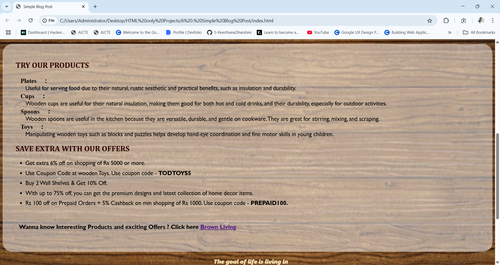

# Project 6 : Simple Blog Post

## 🌲 Project Title:
**Woody Hoody – Leading the Life with Woods**

## 📌 Problem Statement:
Design and develop a simple, elegant blog post page using HTML and CSS that promotes eco-friendly wooden products. The page should inform users about the benefits of using wooden items, highlight product types, showcase offers, and provide contact details for further inquiries.

## ✨ Features:
- Transparent content boxes over a wooden texture background.
- Product images displayed in a flexible grid.
- Discount offers and coupon information.
- Embedded quote to create emotional connection.
- External link to eco-friendly wooden product website.
- Contact section using `<address>` with clickable email and phone.

## Final Output  

