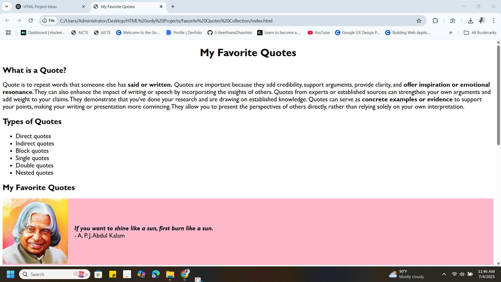
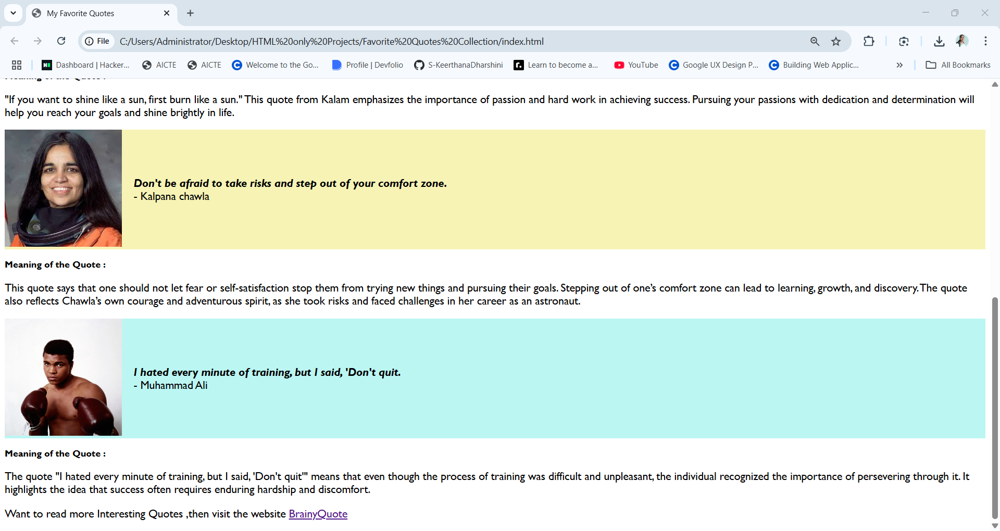

# Project 5: Favorite Quotes Collection

This is **Project 5** in my HTML practice series. It is a simple, static HTML page that showcases a collection of my favorite inspirational quotes, each with a visual element and a brief interpretation.

## ✨ What This Project Includes

- 📌 A well-structured HTML page with headings and paragraphs  
- 📝 Explanations for each quote to give context and deeper meaning  
- 🧠 Organized layout using sections and containers  
- 🖼️ Images of the people behind the quotes  
- 🔗 External link to [BrainyQuote](https://www.brainyquote.com) for more exploration  

## ✨ Output Screenshots

