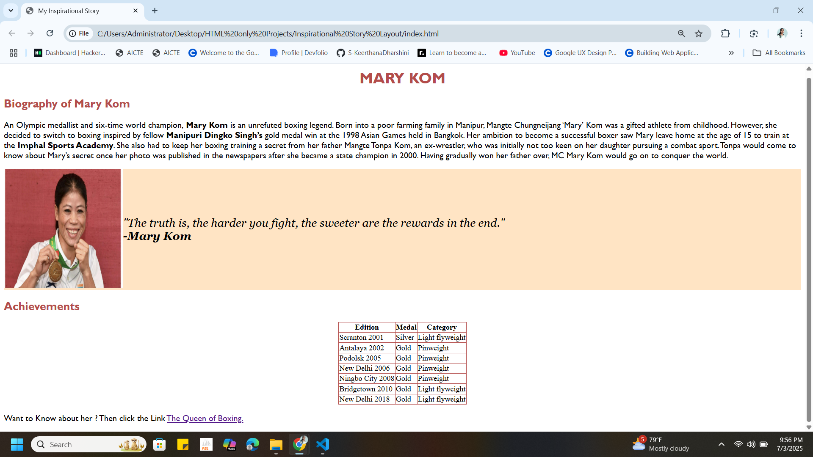

# Project 4: Inspirational Story Layout

This is the fourth project in my **HTML Foundation Series**. It is a static HTML page that presents an inspirational story using clean content organization and semantic HTML tags.

## 📖 What This Project Includes

- A main heading as the title of the story  
- Introduction and background information  
- Multiple subheadings to divide story sections (e.g., Early Life, Challenges, Achievements)  
- Highlighted takeaways using `<strong>` and `<em>`  
- (Optional) An image representing the story  
- External link to a relevant video or article

## 🛠️ Built With

- HTML5 only  
- No CSS or JavaScript

## 🖼️ Output Screenshot

